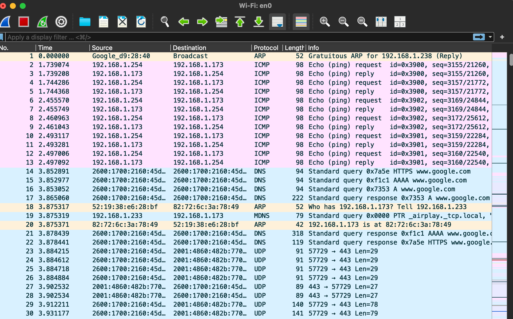
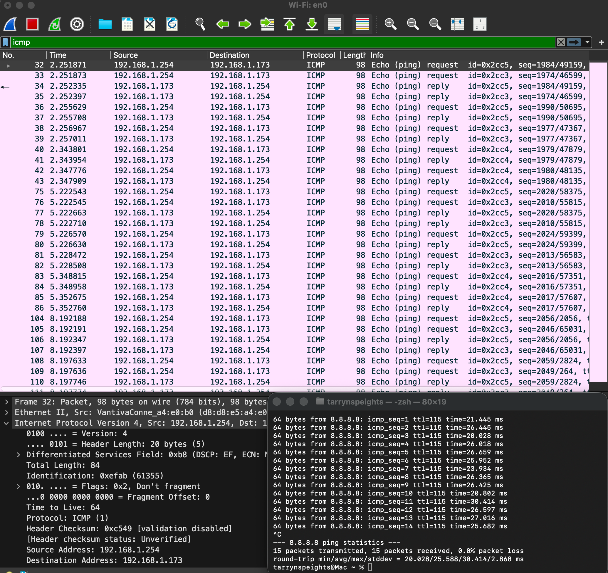
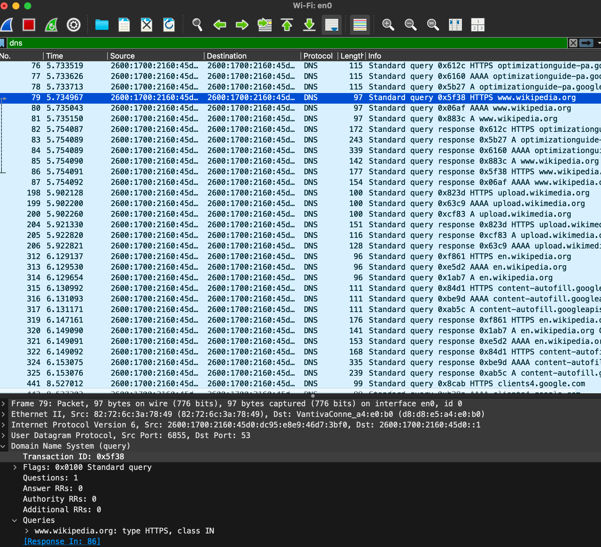

# Network Traffic Analysis

## Overview

This project demonstrates the use of Wireshark to capture and analyze network traffic generated during normal network activity. The purpose of this project was to gain hands-on experience identifying common network protocols, understanding packet structure, and learning how network communication occurs between devices.

Throughout this project, packet captures were analyzed to identify ICMP, DNS, TCP, and TLS traffic while documenting the role each protocol plays in modern computer networks.

---

## Objectives

- Capture live network traffic using Wireshark
- Identify common network protocols
- Analyze ICMP traffic
- Analyze DNS traffic
- Analyze TCP connections
- Observe encrypted TLS traffic
- Practice basic packet analysis

---

## Lab Environment

| Component | Details |
|-----------|----------|
| Operating System | macOS |
| Packet Analyzer | Wireshark |
| Network Interface | Wi-Fi (en0) |
| Traffic Generated | Web browsing and ICMP Ping |

---

## Skills Demonstrated

- Packet Capture
- Network Traffic Analysis
- Protocol Identification
- Basic Network Troubleshooting
- Wireshark Filtering
- Cybersecurity Fundamentals

---

## Investigations

- Live Packet Capture
- ICMP Packet Analysis
- DNS Packet Analysis
- TCP Packet Analysis
- TLS Packet Analysis
- Protocol Hierarchy Statistics

---

## Lessons Learned

This section will summarize the knowledge and experience gained after completing the project.

---

# Investigation 1. Live Packet Capture

## Objective

Capture live network traffic using Wireshark to observe real time network communications.

## Procedure

The active Wi-Fi interface (en0) was selected in Wireshark and a live packet capture was started. While the capture was running, normal web browsing activity was performed to generate common network traffic for analysis.

## Screenshot

## Findings

The packet capture immediately displayed multiple network protocols communicating across the local network. Wireshark identified the source address, destination address, protocol type, packet length, and additional details for each packet.

This demonstrated how Wireshark provides real time visibility into network communications and serves as an essential tool for network troubleshooting and cybersecurity investigations.

---

# Investigation 2. ICMP Packet Analysis

## Objective

Capture and analyze Internet Control Message Protocol (ICMP) traffic generated by the ping command to better understand how devices verify network connectivity.

## Procedure

A continuous ping was initiated from the terminal while Wireshark captured network traffic. The display filter imcp was applied to isolate ICMP packets and simplify the analysis.

## Screenshot

## Findings

The ICMP packet capture displayed Echo Request and Echo Reply messages exchanged between devices on the local network. Each Echo Request was followed by an Echo Reply, confirming successful communication between the participating hosts.

The analysis identified the source and destination IP addresses, ICMP protocol type, and IPv4 header information including a Time to Live (TTL) value of 64. The accompanying terminal output also confirmed successful communication with Google's public DNS server (8.8.8.8), showing 15 packets transmitted, 15 packets received, and 0.0 percent packet loss.

This investigation demonstrates how ICMP traffic can be used to verify network connectivity and troubleshoot communication issues.

---

# Investigation 3. DNS Analysis

## Objective

Analyze Domain Name System (DNS) traffic to understand how domain names are translated into IP addresses before a connection to a website is established.

## Procedure

A new packet capture was started in Wireshark while visiting a website. After the page loaded, the capture was stopped and the display filter `dns` was applied to isolate DNS traffic. A DNS query packet was selected to examine the requested domain name and the corresponding response.

## Screenshot

## Findings

The DNS capture showed the client sending a standard query to resolve the domain **www.wikipedia.org** before establishing a connection to the website. The packet details identified a single DNS query followed by a corresponding response from the DNS server.

The capture also demonstrated that DNS traffic can include different record types, including HTTPS, A, and AAAA records. These records provide the information necessary for the client to locate and securely communicate with the requested website.

This investigation illustrates how DNS acts as the Internet's directory service by translating human readable domain names into network addresses that applications can use to establish connections.
